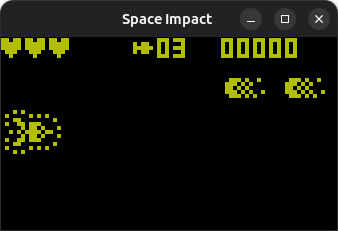

# Space Impact with SDL2

The purpose of this project is to update the original code to work with SDL2 library version.
The original repository is in the following link: [Space-Impact-II](https://github.com/VoidXH/Space-Impact-II)

Almost all code was copied as it is, however the comments were translated to english with help of
Google Translate. In some cases it was necessary to modify the code to make it work.

Screenshot of the game:



The project was built with the following software:
- Meta-build system: cmake 3.28.2 (snap version)
- Build system: GNU Make 4.3
- Compiler: gcc 12.3.0
- OS: Ubuntu 23.04

The project uses the following libraries:
- SDL2 v2.0.12
- math

## Compile the game

Before compiling the game it is important to already have installed the SDL2 library.

To compile run the following commands:

```bash
cmake -S ./ -B build/
cd build
make
```

And to run the game just write the following commands:

```bash
cd build
./space-impact
```